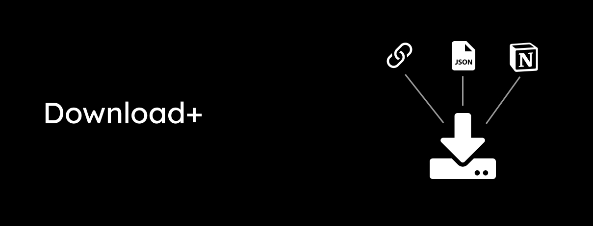
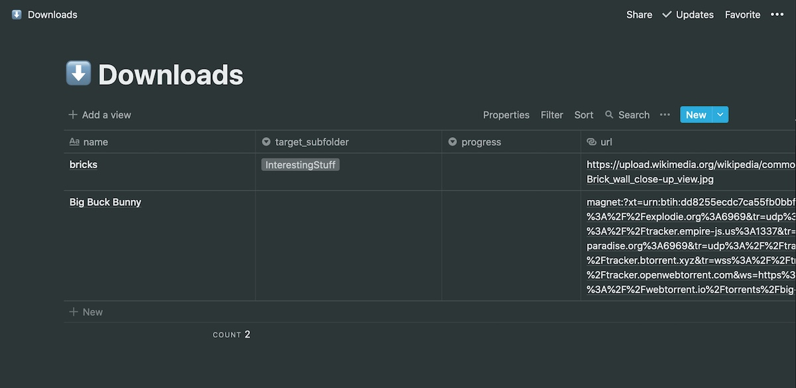

A download manager that takes urls, json files as well as Notion as an input and can download files from an URL as well as via torrent.

Want to support the development and stay updated?

<a href="https://www.patreon.com/bePatron?u=24983231"></a> <a href="https://liberapay.com/glowingkitty/donate"></a>

## Installation
Clone this repo.


## Usage
```python
from downloadplus import Downloader
```

### Download from an url
```python
Downloader(input_url='https://upload.wikimedia.org/wikipedia/commons/thumb/d/d1/Brick_wall_close-up_view.jpg/440px-Brick_wall_close-up_view.jpg').process()
```

### Download from urls from a json file
Make sure the json file is formated like in the following example:
```json
[
    {
        "name": "bricks",
        "target_subfolder": "InterestingStuff",
        "progress": null,
        "url": "https://upload.wikimedia.org/wikipedia/commons/thumb/d/d1/Brick_wall_close-up_view.jpg/440px-Brick_wall_close-up_view.jpg"
        
    },
    {
        "name": "Big Buck Bunny",
        "target_subfolder": null,
        "progress": null,
        "url": "magnet:?xt=urn:btih:dd8255ecdc7ca55fb0bbf81323d87062db1f6d1c&dn=Big+Buck+Bunny&tr=udp%3A%2F%2Fexplodie.org%3A6969&tr=udp%3A%2F%2Ftracker.coppersurfer.tk%3A6969&tr=udp%3A%2F%2Ftracker.empire-js.us%3A1337&tr=udp%3A%2F%2Ftracker.leechers-paradise.org%3A6969&tr=udp%3A%2F%2Ftracker.opentrackr.org%3A1337&tr=wss%3A%2F%2Ftracker.btorrent.xyz&tr=wss%3A%2F%2Ftracker.fastcast.nz&tr=wss%3A%2F%2Ftracker.openwebtorrent.com&ws=https%3A%2F%2Fwebtorrent.io%2Ftorrents%2F&xs=https%3A%2F%2Fwebtorrent.io%2Ftorrents%2Fbig-buck-bunny.torrent"
    }
]
```
then process it...
```python
Downloader(input_json_path='example.json').process()
```

### Download from urls from a Notion database
Make sure you have a page with a "full page database" and the following fields:
- name
- progress
- url
- target_subfolder



Then get your Notion ```token_v2``` from the cookies in your webbrowser and process the Notion page...
```python
Downloader(notion_token='{{token_v2}}',input_notion_url='{{notion_page_url}}').process()
```